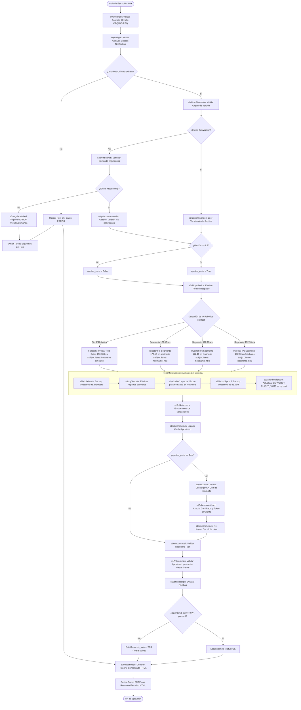

# 🛠️ Configuración Automatizada de Clientes NetBackup (Ansible AWX)

Este repositorio contiene la solución de automatización mediante Ansible (Playbook maestro `main_config_netbackup.yml` y Rol `role_config_netbackup`) diseñada para la estandarización, re-direccionamiento de red y validación de comunicación de clientes NetBackup en entornos Linux corporativos ejecutados desde **Ansible Automation Platform (AWX / Tower)**.

---

## 📋 Índice
1. [Visión General del Proyecto](#-visión-general-del-proyecto)
2. [Flujo de Funcionamiento y Toma de Decisiones](#-flujo-de-funcionamiento-y-toma-de-decisiones)
3. [Diagrama de Flujo (Mermaid)](#-diagrama-de-flujo-mermaid)
4. [Direccionamiento IP y Segmentación de Hosts](#-direccionamiento-ip-y-segmentación-de-hosts)
5. [Fases de Ejecución Detalladas](#-fases-de-ejecución-detalladas)
6. [Generación de Reporte y Notificaciones](#-generación-de-reporte-y-notificaciones)
7. [Variables Principales](#-variables-principales)

---

## 🎯 Visión General del Proyecto

El objetivo principal de esta automatización es re-direccionar y estandarizar de forma masiva y segura la comunicación de los hosts remotos hacia los **Servidores Maestros y de Medios (Media Servers)** de NetBackup. La configuración se adapta dinámicamente según la infraestructura de red del cliente, priorizando las **Redes Robóticas (`172.10.x.x`, `172.11.x.x`, `172.13.x.x`)** o aplicando un **Fallback a la Red de Datos (`150.100.x.x`)**.

Adicionalmente, la solución:
- Garantiza la idempotencia y seguridad creando **backups con *timestamps*** (`.bak_YYYY-MM-DD_epoch`) de los archivos sensibles `/etc/hosts` y `bp.conf` antes de cualquier modificación.
- Estandariza el parámetro `CLIENT_NAME` asignando sufijos específicos (`<hostname>_nbu` en red robótica o `<hostname>` en red de datos).
- Gestiona certificados de seguridad SSL/TLS para versiones de NetBackup 8.2 o superiores.
- Realiza pruebas de conectividad bidireccional y resolución nativas (`bpclntcmd -self`, `bpclntcmd -pn`).
- Genera un **Dashboard Consolidado HTML** y notifica por correo SMTP el resultado gerencial y técnico del inventario.

---

## 🔀 Flujo de Funcionamiento y Toma de Decisiones

La ejecución sigue una secuencia lógica estricta condicionada por el estado de cada nodo remoto:

1. **Validación de Parámetros de Entrada (`s0chkidhelix`)**: Se verifica a nivel local que el ticket de cambio o incidente (`idcrqinc`) cumpla con el formato regular corporativo `(CRQ|INC|REQ)[0-9]{12}`.
2. **Chequeo Preflight (`s0preflight`)**: Valida la existencia de los binarios y archivos esenciales de NetBackup (`bp.conf`, `bpclntcmd`, `nbcertcmd`). Si falta algún archivo crítico, el host se marca en estado **`ERROR`** y se omiten las tareas posteriores para ese servidor.
3. **Detección de Versión de NetBackup (`s1-s5`)**:
   - Intenta leer la versión desde el archivo `/usr/openv/netbackup/bin/version` (`s1-s2`).
   - Si no existe el archivo, evalúa la disponibilidad del comando `nbgetconfig` (`s3-s4`).
   - Si ninguna opción está presente, registra fallo (`s5`).
   - Evalúa si la versión detectada es `>= 8.2` para activar la bandera de gestión de certificados (`applies_certs`).
4. **Identificación de IP Robótica y Asignación de Direcciones (`s6chkiprobotica`)**:
   - Analiza las interfaces IPv4 del host remoto buscando coincidencias en los rangos robóticos `172.10`, `172.11` o `172.13`.
   - **Con IP Robótica**: Asigna el sufijo `_nbu` al cliente (`<hostname>_nbu`) y selecciona la tabla de IPs robóticas de Media/Master Servers del segmento correspondiente.
   - **Sin IP Robótica**: Aplica la regla de **Fallback de Red de Datos (`150.100.x.x`)**, utilizando el nombre del host original sin sufijo.
5. **Reconfiguración de Archivos del Sistema (`s7-s11`)**:
   - Realiza backup de `/etc/hosts` y elimina registros obsoletos de NetBackup.
   - Inyecta la tabla de IPs y hostnames parametrizada en `/etc/hosts` (`s9addnbhf`).
   - Realiza backup de `/usr/openv/netbackup/bp.conf`.
   - Inyecta la lista de servidores autorizados (`SERVER = ...`) al inicio del archivo `bp.conf` y configura el parámetro `CLIENT_NAME = <nbcltsfx>`.
6. **Limpieza, Certificados y Validación de Comunicación (`s12-s18`)**:
   - Limpia la caché local de resoluciones (`bpclntcmd -clear_host_cache`).
   - Si `applies_certs == true` (versión >= 8.2), obtiene el certificado CA del Master Server (`vxnbucfs`) y vincula el certificado del cliente mediante el token corporativo (`cfs_token`).
   - Ejecuta validaciones de resolución local (`bpclntcmd -self`) y prueba de comunicación con el Master Server (`bpclntcmd -pn`).
   - Clasifica el estado final del servidor como **`OK`** (si ambas pruebas fueron exitosas) o **`TBS`** (To Be Solved / A Resolver).
7. **Reporte Consolidado HTML y Notificación por Correo (`s19nbconfrepo`)**:
   - En el host delegado (`srv_delegate`), consolida los datos de todos los nodos en un informe HTML y envía un correo electrónico SMTP.

---

## 📊 Diagrama de Flujo (Mermaid)

---

## 🌐 Direccionamiento IP y Segmentación de Hosts

Según la interfaz de red identificada en la tarea `s6chkiprobotica.yml`, el rol inyecta las siguientes parejas de Dirección IP y Nombre de Host en `/etc/hosts` (`s9addnbhf.yml`):

### 1. Segmento Robótico `172.10.x.x`
- **Master Server / CFS:** `172.10.117.246 vxnbucfs`
- **Media Server 3:** `172.10.119.20 cpdnbumedia3-le`
- **Media Server 6:** `172.10.120.245 cpdnbumedia6-le`
- **Reserva / Media:** `172.10.120.132 lvprpbckrescc01-cfs`
- **Cliente Remoto:** `<IP_Robotica_172.10.x.x> <hostname>_nbu`

### 2. Segmento Robótico `172.11.x.x`
- **Master Server / CFS:** `172.11.110.84 vxnbucfs`
- **Media Server 3:** `172.11.110.83 cpdnbumedia3-le`
- **Media Server 6:** `172.11.110.87 cpdnbumedia6-le`
- **Reserva / Media:** `172.10.120.132 lvprpbckrescc01-cfs`
- **Cliente Remoto:** `<IP_Robotica_172.11.x.x> <hostname>_nbu`

### 3. Segmento Robótico `172.13.x.x`
- **Master Server / CFS:** `172.13.103.137 vxnbucfs`
- **Media Server 3:** `172.13.103.136 cpdnbumedia3-le`
- **Media Server 6:** `172.13.103.176 cpdnbumedia6-le`
- **Reserva / Media:** `172.10.120.132 lvprpbckrescc01-cfs`
- **Cliente Remoto:** `<IP_Robotica_172.13.x.x> <hostname>_nbu`

### 4. Fallback Red de Datos (Sin IP Robótica)
En caso de que el servidor no posea una IP en los rangos robóticos `172.10/11/13`, se enruta a través de la Red de Datos:
- **Master Server / CFS:** `150.100.246.180 vxnbucfs`
- **Media Server 3:** `150.100.230.208 cpdnbumedia3-le`
- **Reserva / Media:** `150.80.8.37 lvprpbckrescc01-cfs`
- **Cliente Remoto:** `<IP_Default_Datos> <hostname>` *(sin sufijo `_nbu`)*

---

## 🛠️ Fases de Ejecución Detalladas

| Tarea (`.yml`) | Fase / Nombre | Descripción y Función |
|---|---|---|
| `s0chkidhelix.yml` | Validar Ticket Helix | Verifica que la variable `idcrqinc` contenga una sintaxis válida de ticket (`CRQ`, `INC` o `REQ` seguido de 12 dígitos). |
| `s0preflight.yml` | Check de Archivos Críticos | Comprueba la presencia de `bp.conf`, `bpclntcmd` y `nbcertcmd`. Marca `cfs_status: ERROR` si alguno falta. |
| `s1chknbfileversion.yml` | Evaluar Archivo Versión | Revisa la existencia de `/usr/openv/netbackup/bin/version` para definir la vía de lectura de la versión. |
| `s2getnbfileversion.yml` | Leer Versión por Archivo | Obtiene la versión mediante `cat version` y evalúa si se requiere certificado (`>= 8.2`). |
| `s3chknbcomm.yml` | Evaluar Comando Versión | En caso de no existir el archivo versión, valida la existencia de la herramienta `nbgetconfig`. |
| `s4getnbcommversion.yml` | Leer Versión por Comando | Obtiene la versión ejecutando `nbgetconfig` y determina si requiere certificado. |
| `s5msgnbcmfailed.yml` | Registrar Error de Versión | En caso de fallar ambas vías de versionamiento, marca el nodo con `cfs_status: ERROR`. |
| `s6chkiprobotica.yml` | Inspección de Red y Sufijo | Identifica la IP Robótica (`172.10/11/13`), define el sufijo del cliente (`_nbu` o sin sufijo) y enruta las tareas. |
| `s7bckfilehosts.yml` | Respaldo `/etc/hosts` | Genera una copia de seguridad timestamped `/etc/hosts.bak_YYYY-MM-DD_epoch`. |
| `s8prgfilehosts.yml` | Limpieza `/etc/hosts` | Remueve entradas y variantes obsoletas de hostnames de NetBackup en `/etc/hosts`. |
| `s9addnbhf.yml` | Inyección `/etc/hosts` | Inyecta el bloque de direcciones IP y hostnames correspondiente al segmento detectado. |
| `s10bcknbbpconf.yml` | Respaldo `bp.conf` | Crea copia de seguridad timestamped `/usr/openv/netbackup/bp.conf.bak_YYYY-MM-DD_epoch`. |
| `s11addnbmcbpconf.yml` | Reconfiguración `bp.conf` | Inyecta los servidores `SERVER` en cabecera y configura `CLIENT_NAME = <nbcltsfx>`. |
| `s12chknbcomm.yml` | Control de Validaciones | Redirecciona el flujo incluyendo la gestión de certificados si `applies_certs == true`. |
| `s13nbcommclnch.yml` | Limpiar Caché | Purga la caché de resolución del cliente NetBackup con `bpclntcmd -clear_host_cache`. |
| `s14nbcommcrttknms.yml` | Descarga Certificado CA | Descarga el certificado CA del Master Server `vxnbucfs` (`nbcertcmd -getCaCertificate`). |
| `s15nbcommcrttkncl.yml` | Registro Certificado Cliente | Asocia el certificado del cliente utilizando el token corporativo `cfs_token` (`nbcertcmd -getCertificate`). |
| `s16nbcommself.yml` | Validación Auto-Resolución | Ejecuta `bpclntcmd -self` para validar que el cliente resuelve su propia IP y nombre. |
| `s17nbcommpn.yml` | Validación Conexión Master | Ejecuta `bpclntcmd -pn` para validar la conexión bidireccional hacia el Master Server. |
| `s18chknbselfpn.yml` | Dictamen Final del Nodo | Asigna `cfs_status: OK` si ambas pruebas retornan `rc == 0`, o `cfs_status: TBS` si falla alguna. |
| `s19nbconfrepo.yml` | Reporte y Notificación | Genera el informe HTML consolidado en el servidor delegado y lo envía por correo electrónico SMTP. |

---

## 📊 Generación de Reporte y Notificaciones

Una vez procesados todos los servidores del inventario, la fase `s19nbconfrepo.yml` ejecuta las siguientes acciones de forma centralizada en el servidor delegado (`srv_delegate`):

1. **Ubicación del Reporte:** `/var/opt/ansible/netbackup/<tower_job_id>/reporte_<idhelix>_consolidado_cfs_<fecha>.html`
2. **Generación del Dashboard:** Renderiza la plantilla Jinja2 `consolidated_cfs_report.html.j2` recopilando las variables de cada host.
3. **Notificación SMTP:** Envía un correo electrónico en formato HTML con un resumen ejecutivo que incluye:
   - Total de servidores evaluados.
   - Conteo y desglose de nodos en estado **OK**, **TBS** (To Be Solved) y **ERROR**.
   - Detalle individual por host: IP asignada (Robótica o Datos), sufijo de cliente, versiones y resultado de comandos `bpclntcmd`.

---

## ⚙️ Variables Principales

| Variable | Ejemplo / Valor por Defecto | Descripción |
|---|---|---|
| `actions` / `action` | `Configurar_NetBackup` | Acción seleccionada desde el formulario AWX. |
| `idcrqinc` | `CRQ000000123456` | Número de Cambio o Incidente Helix. |
| `cfs_token` | `FIFZIXYHMOHNRGHG` | Token de seguridad para despliegue de certificados NetBackup 8.2+. |
| `filehosts` | `/etc/hosts` | Ruta del archivo de hosts del sistema operativo. |
| `nbfbpconf` | `/usr/openv/netbackup/bp.conf` | Ruta del archivo principal de configuración NetBackup. |
| `srv_delegate` | `lvdasb5gmx02.bvm.bluecare.kyndryl.net` | Servidor delegado para la generación del informe y envío de mail. |
| `smtp_server` | `10.252.25.46` | IP del servidor SMTP corporativo. |
| `email_recipients` | `usuario1@company-x.ldn` | Destinatarios principales del correo de certificación. |

---

> *Desarrollo diseñado para entornos corporativos gestionados mediante flujos CI/CD o ejecución bajo demanda en plataformas Ansible AWX / Ansible Tower.*
